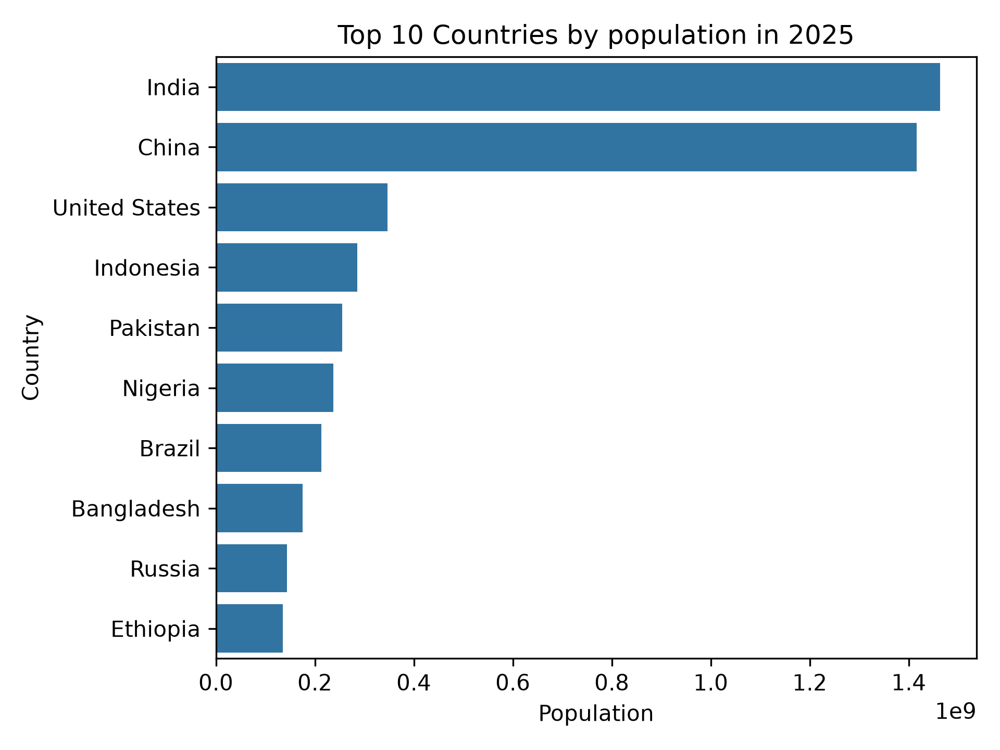
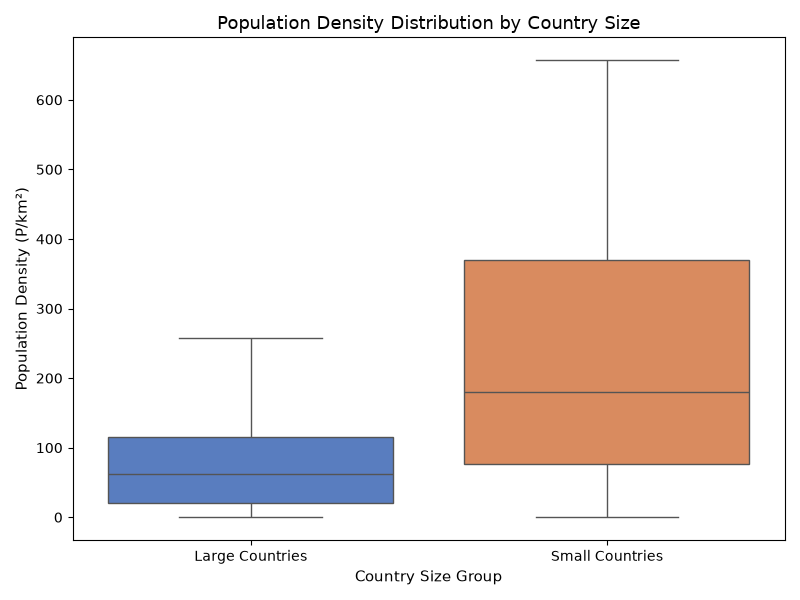

# World Population Analysis (2025)

An Exploratory Data Analysis (EDA) project investigating global demographic architectures, geographic density variations, urbanization rates, and population growth patterns projected for the year 2025.

---

## 📌 Project Introduction & Objectives

In modern data analytics, processing demographic indicators serves as a technical proof of work for data science structures. The primary goal of this project is to parse raw global population statistics, manage data distributions, execute structural cleaning, and employ statistical charts to extract meaningful regional insights.

### Core Objectives:
*   **Automate Ingestion:** Pipeline raw records using automated script downloads via `kagglehub`.
*   **Data Validation:** Verify structural metadata shapes, manage null vectors, and handle notebook environment notifications safely.
*   **Statistical Profiling:** Evaluate the numeric relationships governing population size against density boundaries and localized growth factors.
*   **Visual Documentation:** Generate actionable, presentation-ready visualizations to interpret abstract demographic spreads seamlessly.

---

## 🛠️ Environment Configuration & Technical Stack

This project is built using the standard Python data science ecosystem. The required dependencies are listed below and managed via `requirements.txt`:

*   **Core Language Stack:** `Python 3.14`
*   **Data Pipeline Infrastructure:** `kagglehub` (Dataset sourcing)
*   **Data Analysis Framework:** `pandas` & `numpy` (Vectorized manipulation, structural cleansing, and multi-index grouping)
*   **Visualization Engines:** `matplotlib.pyplot` & `seaborn` (Statistical visualization and aesthetic plotting layers)

---

## 📊 Dataset Structure & Feature Mapping

Based on the initial programmatic audit (`df.head()`), the ingestion layer safely loads 12 comprehensive features detailing regional attributes across international boundaries:

| Attribute Name | Variable Type | Descriptive Context |
| :--- | :--- | :--- |
| `id` | Integer | System assigned index identifier |
| `Country (or dependency)` | Object / Text | Regional naming designation for global territories |
| `Population 2025` | Integer | Projected absolute headcount metric |
| `Yearly Change` | Percentage | Standard annualized population fluctuation rate |
| `Net Change` | Integer | Net numeric difference in regional headcount |
| `Density (P/Km²)` | Numeric | Demographic concentration density (Individuals per Square Kilometer) |
| `Land Area (Km²)` | Numeric | Total territorial physical area scale |
| `Migrants (net)` | Numeric | Net international cross-border population migration totals |
| `Fert. Rate` | Numeric | Mean regional fertility baseline indicators |
| `Median Age` | Numeric | Median chronological age structure of the resident population |
| `Urban Pop %` | Percentage | Share of the localized populace residing in high-density urban environments |
| `World Share` | Percentage | Overall proportional contribution to the cumulative global population |

---

## 📊 Exploratory Visualizations & Key Findings

As prioritized in professional project portfolios, visual data layers provide faster situational context than code frameworks. The analysis isolates critical behaviors using the following core visual models:

###1.Global Population Distribution (Barplot)
This analysis highlights the world's most populated geographic nations. The chart highlights the significant population disparities between the  top-ranked nations,such as India and China and remainder of dataset.



###2.Population Density Distribution (Boxplot)
By isolating population densities (`Density (P/Km²)`), this visual maps statistical distributions and highlights extreme demographic clustering anomalies. It indicates whether localized landmass constraints directly accelerate urban migration metrics.



### 💡 Summary of Core Analytical Discoveries
*   **Asymmetric Scaling:** A minor percentage of total global nations command the absolute majority share of the total world population.
*   **Growth Inversion Trends:** Select ultra-high-population territories display inverse (negative) growth behaviors, whereas emerging regions display sharp numeric gains.
*   **Urbanization Correlation:** Higher territorial density rates systematically trace a strong positive correlation with increased percentage indices in the `Urban Pop %` variable.

---

## ⚙️ Local Reproduction Instructions

To deploy, audit, and execute this repository locally on your machine, clone the repository and trigger the runtime pipeline within your local project environment:

```bash
# 1. Clone the project workspace locally
git clone https://github.com/hiralirs/world-population-analysis-2025.git
cd world-population-analysis-2025

# 2. Bulk install ecosystem dependencies from the requirements manifest
pip install -r requirements.txt

# 3. Launch the local interactive runtime kernel
jupyter notebook main.ipynb
'''
